# pr-grill

PRを出す前に、自分の変更の「なぜ」を全部説明できるようにするClaude Codeスキルです。レビュー対応中にも使えます。

使うのはPRの作者です。レビュアー向けではありません。

Claudeは次のことをします。

1. 差分を読んで、何がどう変わるかと、どこに影響するかを整理します
2. レビュアーが聞きそうな質問と、その回答案を作ります
3. 回答案を「コードから分かること」と「作者にしか分からないこと」に分けます
4. 「作者にしか分からないこと」を、作者に1問ずつ聞いて埋めていきます

Claudeは理由を勝手に作りません。そのため、レビューで「自分では説明できない理由」を口にする事故が起きません。

[English README](README.md)



<sub>台本付きデモ(42秒)。収集スクリプトの出力は本物、対話は再現です。[MP4版](demo/pr-grill.ja.mp4)。</sub>

## PRがたどる流れ

```
変更を書く
   │
   ▼
Brief    「自分の変更を理解したい」   → 変更の地図、影響範囲、ラベル付き想定問答 → PR_QA.md
   │
   ▼
Grill    「詰めて」                   → [作者確認]を1問ずつ全部解消
   │
   ▼
PRを出す
   │
   ▼
Reply    レビューコメントを貼る       → 分類と、根拠付きの返信案
   │
   ▼
Revise   「修正をpushした」           → レビュー以降の差分だけを、修正ごとに確認。
   │                                   再レビュー用のまとめ
   ▼
merge    → 戦績に1行(理解度%、弱いレンズ)。Drillはいつでも予行演習に使えます
```

## どのレベルから始めても、ゴールは同じ

最初のターンで2つ聞きます。その変更を誰が書いたか(自分 / AIに指示して / 他人のブランチを引き継いだ)と、そのコード領域をどれだけ知っているか。これで**道筋**が決まります。初めての人には、質問の前にコードを平易な言葉で説明し、Drillではヒントを先に出します。その領域の持ち主には、説明を省き、Grillで推奨回答を出さず(持ち主でも引きずられるので)、Drillは鬼難易度にします。

**ゴールは全員同じ**です。次の5問に自分の言葉で答えられるまで、セッションは終わりません。

1. このPRが何を変えるか。プロジェクト外の同僚にも分かる一文で
2. 明日revertしたら、何が壊れて何が直るか
3. 変更したコードを誰が呼んでいて、どの呼び出し元が一番危ないか
4. 一番踏みそうなエッジケースと、そこでコードがどう動くか
5. 本番で壊れたとき、誰がどうやって気づくか

他人のブランチを引き継いだ場合、「作者に聞く」は「元の作者に聞く」になります。`git log`から元の作者を見つけ、その人に持っていく質問の一覧を渡します。Grillで詰められるのは、引き継いでから自分が変えた部分だけです。

## 出力に付くラベル

生成される`PR_QA.md`の回答には、必ず次のどれかが付きます。

| ラベル | 意味 |
|---|---|
| `[コード根拠]` | 差分、周辺コード、テスト、git履歴から事実として言えること。`ファイル:行`付き |
| `[推測]` | 妥当な推測。根拠を一言添えます |
| `[作者確認]` | 意図、トレードオフ、却下案など、作者しか知らないこと。Claudeは捏造しません |
| `[作者回答]` | 作者が自分の言葉で答えたこと(Grillの後に付きます) |
| `[作者承認]` | Claudeの仮説に作者が同意しただけのもの。`[作者回答]`より弱く、そう明示されます |

ラベルは、あなたがClaudeに話しかけている言語で表示されます(スキル本文は英語です)。

## モード

| モード | 言い方 | やること |
|---|---|---|
| **Brief**(既定) | 「PR出す前に確認したい」 | 変更の地図、振る舞いの差分、影響範囲、ラベル付き想定問答、独自チェックを`PR_QA.md`に書き出します |
| **Grill** | 「詰めて」「意図を整理したい」 | `[作者確認]`を決定木の根から1問ずつ解消します([grill-me](https://github.com/mattpocock/skills)の考え方をPRに適用したものです) |
| **Drill** | 「試験して」「理解度チェック」 | 口頭試問です。1問ずつ出題し、コードと照らして採点し、弱点を列挙します |
| **Reply** | レビューコメントを貼る | コメントを分類し、根拠付きの返信案を作ります。レビュアーが間違っている場合も含みます |
| **Revise** | 「修正を push した」「再レビューに出せる?」 | レビュー以降の差分だけを見て(`--since`)、各修正をスレッドに対応付け(`--pr`)、修正ごとに「元の何が問題で、なぜこれで直るか」を聞き、再レビュー用のまとめを作ります |

Briefの独自チェックは次のとおりです。AI生成コードの説明責任チェック(「この行が無いと何が壊れる?」)、Revert思考実験、却下案台帳、深夜障害テスト、PR説明文と差分の整合性、意図しない約束の検出、未実行チェックの列挙、CODEOWNERSからのレビュアー予測。

## インストール

Claude Codeのプラグインとして入れる方法(推奨。`/plugin update`で更新できます)。

```
/plugin marketplace add kenmori/pr-grill
/plugin install pr-grill@pr-grill
```

skills CLIで入れる方法。

```bash
npx skills add kenmori/pr-grill
```

手動で入れる場合は、次のようにコピーします。

```bash
git clone https://github.com/kenmori/pr-grill
cp -r pr-grill/skills/pr-grill ~/.claude/skills/pr-grill
```

必要なのは`git`と`bash`(3.2以上。macOS標準のbashで動きます)だけです。`gh`があれば、PRのタイトル、本文、レビュアーも取得します。

## 使い方

任意のリポジトリのフィーチャーブランチで、次のように話しかけます。

```
> 自分の変更を理解したい
```

Claudeが`scripts/collect_pr_context.sh`を実行し、`.claude/pr-grill/<ブランチ名>/PR_QA.md`を書き出します。このディレクトリは共有の`info/exclude`に自動登録されるので、コミットされません。`git worktree`で作ったチェックアウトでも同じように動きます。

出力ディレクトリはgitには無視されますが、ディスクには残ります。`full.diff`と`diff/*.patch`には差分がそのまま入ります。要約では秘密情報らしき値を伏せますが、差分そのものに秘密が含まれているときは、対処したあとで`.claude/pr-grill/`を削除してください。最後に、未解消の最初の1問をGrillで詰めるか聞いてきます。

収集スクリプトは単体でも使えます。

```bash
skills/pr-grill/scripts/collect_pr_context.sh [--out DIR] [--no-diff] [--stdout] [--since REF|last] [--pr N] [base-branch]
```

`--since`を付けるとレビュー対応モードになり、`REF`以降(`last`なら前回の実行以降)のコミットだけを対象にします。`--pr N`は`gh`があるときに、PRの各レビュースレッドと、差分がその箇所に触れているかを出します。

出力する内容は次のとおりです。baseの鮮度、未追跡ファイル、除外した生成物、テスト変更の有無、CODEOWNERS、要注意パターンと秘密情報らしき値(`ファイル:行`付き)、変更されたシグネチャ、差分外の呼び出し元(更新し忘れたもの)、リポジトリのレビュー規約、レビュアーが「実行した?」と聞くチェック。大きい差分は`diff/`にファイル別に分割します。

## 戦績

Grill、Drill、Reviseを終えるたびに、`.claude/pr-grill/stats.log`(git管理外、リポジトリごと)に1行が残ります。

```
Readiness ████████░░ 85%  (code 4 · author 4 · approved 1 · open 1 of 10)  Drill 5/8  Stumbled: ops, tests
```

Readinessは、設計判断のうち自分の言葉で説明できた割合です。`[approved]`(Claudeの推測に同意しただけ)は半分に数えます。「戦績見せて」と言うと、過去のPRの一覧と、繰り返し詰まっているレンズが出ます。次のBriefは、そのレンズの質問から始まります。過去の`PR_QA.md`は`.claude/pr-grill/<ブランチ名>/`に、消すまで残ります。

## 出力例

[`examples/PR_QA.example.md`](examples/PR_QA.example.md)は、このリポジトリ自身のPRにスキルをかけて作ったBriefの出力です。

## 開発

```bash
shellcheck skills/pr-grill/scripts/collect_pr_context.sh tests/fixture.sh
tests/fixture.sh
```

`tests/fixture.sh`は使い捨てリポジトリを作って、収集スクリプトの出力を検証します。関数のリネーム、`console.log`の混入、ハードコードされた鍵、ネストした`dist/`、`clock.ts`という名前のソース(ロックファイル扱いしてはいけないもの)、未追跡ファイルを含めてあります。

## クレジット

GrillモードはMatt Pocockの[grill-me](https://github.com/mattpocock/skills)の決定木インタビューをPR向けに適用したものです。
