# pr-grill

A Claude Code skill that gets you ready to **defend your own PR** — before you open it, and while reviewers are picking at it.

It is for the *author*, not the reviewer. It reads your diff, maps the blast radius, predicts the questions reviewers will ask, separates what the code can prove from what only you know, and interviews you one question at a time until you can explain every decision.

[日本語版 README](README.ja.md)



<sub>Scripted demo (48 s): the collector output is real, the dialogue is re-enacted. [MP4 version](demo/pr-grill.en.mp4).</sub>

## How a PR goes through it

```
write the change
   │
   ▼
Brief    "I want to understand my change"   → change map, blast radius, labelled Q&A → PR_QA.md
   │
   ▼
Grill    "grill me"                          → every [ask author] resolved, one question per turn
   │
   ▼
open the PR
   │
   ▼
Reply    paste review comments               → classified, evidence-based reply drafts
   │
   ▼
Revise   "I pushed the fixes"                → only the delta since the review, fix-by-fix questions,
   │                                           re-review summary for the reviewer
   ▼
merge    → one line in your record (readiness %, weak lenses); Drill any time for a rehearsal
```

## Any starting level, one finish line

The first turn asks two things: who wrote the change (you / AI under your direction / someone else, you took it over) and how well you know this part of the code. That sets the **path**: a newcomer gets a plain-language walkthrough before any question and hints in Drill; an owner skips the narration, gets no suggested answers in Grill (they anchor like anyone else) and a brutal Drill.

The **finish line is the same for everyone**, five questions you must answer in your own words before the session counts as done:

1. What this PR changes, in one sentence a teammate outside the project would understand.
2. What breaks and what gets fixed if it is reverted tomorrow.
3. Who calls the changed code, and which caller is most at risk.
4. The edge case most likely to bite, and what the code does there.
5. How anyone would notice in production that it broke.

If you inherited the branch, "ask the author" becomes "ask the original author": the skill finds them in `git log` and hands you the list of questions to take to them, and only grills you on what you changed since.

## What you get

Every answer in the generated `PR_QA.md` carries one of these labels:

| Label | Meaning |
|---|---|
| `[code]` | Provable from the diff, surrounding code, tests or git history — with `file:line` |
| `[guess]` | Plausible inference, with the reason stated |
| `[ask author]` | Intent, trade-offs, rejected alternatives — only you know; Claude will not make it up |
| `[author]` | You answered in your own words (after Grill) |
| `[approved]` | You agreed with Claude's hypothesis — weaker than `[author]`, and flagged as such |

Labels are rendered in whatever language you talk to Claude in. That separation is the point. A fabricated "reason" that you repeat in review is worse than no answer.

## Modes

| Mode | Say | What happens |
|---|---|---|
| **Brief** (default) | "check this before I open the PR" | Change map, behaviour diff, blast radius, top questions with labelled answers, extra checks → `PR_QA.md` |
| **Grill** | "grill me", "dig into the intent" | Resolves every `[ask author]` along a decision tree, one question per turn, root first (inspired by [grill-me](https://github.com/mattpocock/skills)) |
| **Drill** | "quiz me", "test my understanding" | Oral exam: questions one at a time, graded against the code, weak spots listed |
| **Reply** | paste a review comment | Classifies each comment and drafts a reply with evidence — including when the reviewer is wrong |
| **Describe** | "write my PR description" | Assembles the PR body from what you already said in Brief and Grill; gaps stay marked "fill in"; prints the `pbcopy` and `gh pr create --body-file` lines |
| **Review brief** | "I'm reviewing PR #N" | For the reviewer side: change map, blast radius, and the questions to ask the author, with no interview |
| **Revise** | "I pushed the fixes", "ready for re-review?" | Looks only at what changed since the review (`--since`), maps each fix to its thread (`--pr`), asks "what was wrong / why does this fix it" per fix, and drafts the re-review summary |

Extra checks in Brief: accountability check for AI-generated hunks ("what breaks without this line?"), revert thought experiment, rejected-alternatives ledger, 3 a.m. incident test, PR description vs. diff consistency, unintended promises, unexecuted CI checks, reviewer prediction from CODEOWNERS.

## Other agents

The skill is in the standard agent-skills layout, so the skills CLI installs it into any of the agents it supports:

```bash
npx skills add kenmori/pr-grill -a cursor      # or -a codex, -a opencode, -a windsurf, …
```

Output goes to `.pr-grill/<branch>/` in the repository (git-ignored through `info/exclude`; `PR_GRILL_DIR` moves it). Verified end to end in Claude Code; other agents run the same `scripts/` and read the same `SKILL.md`, but how eagerly each one executes a skill's scripts differs, so check the first run.

## Install

As a Claude Code plugin (recommended; updates with `/plugin update`):

```
/plugin marketplace add kenmori/pr-grill
/plugin install pr-grill@pr-grill
```

With the skills CLI:

```bash
npx skills add kenmori/pr-grill
```

Or manually:

```bash
git clone https://github.com/kenmori/pr-grill
cp -r pr-grill/skills/pr-grill ~/.claude/skills/pr-grill
```

Requires only `git` and `bash` (3.2+, so macOS stock bash works). `gh` is optional and adds PR title, body and reviewers.

## Usage

In any repository, on your feature branch:

```
> I want to understand my change before I open the PR
```

Claude runs `scripts/collect_pr_context.sh`, writes `.pr-grill/<branch>/PR_QA.md` (automatically git-ignored via the shared `info/exclude`, so it also works inside `git worktree` checkouts), and ends by asking whether to Grill the first unresolved question.

The output directory is ignored by git but stays on disk, and `full.diff` / `diff/*.patch` contain the raw diff. The summary masks secret-shaped values; if the diff itself contains a secret, delete `.pr-grill/` once you have dealt with it.

You can also run the collector yourself:

```bash
skills/pr-grill/scripts/collect_pr_context.sh [--out DIR] [--no-diff] [--stdout] [--since REF|last] [--pr N] [base-branch]
```

`--since` switches to review-round mode: every section covers only the commits since `REF` (or since the previous run, with `last`). `--pr N` adds, when `gh` is installed, each review thread on the PR and whether the diff touches it.

It reports base freshness, untracked files, excluded generated files, test changes, CODEOWNERS, suspicious additions and secret-shaped values with `file:line`, changed signatures, callers **outside the diff** (the ones you forgot to update), repo review conventions, and the checks reviewers will ask whether you ran. Large diffs are split per file under `diff/`.

## Diagrams

When a call chain, data flow or state sequence changed, or two options are being compared, Brief also writes `.pr-grill/<branch>/diagram.html`: a before/after figure in self-contained inline SVG (no libraries, works offline, light and dark), with `path:line` under each node and a one-sentence caption stating the claim. The terminal prints a `file://` link; in Claude Code it can also be published as a private page. If a sentence says it faster, no diagram is drawn.

## Your record

Every Grill, Drill or Revise session ends with a line in `.pr-grill/stats.log` (git-ignored, per repository):

```
Readiness ████████░░ 85%  (code 4 · author 4 · approved 1 · open 1 of 10)  Drill 5/8  Stumbled: ops, tests
```

Readiness is the share of design decisions you can explain in your own words; `[approved]` (you only agreed with Claude's guess) counts half. "Show my stats" prints the table of past PRs and the lenses you keep stumbling on; the next Brief leads with questions from those lenses. Past `PR_QA.md` files stay under `.pr-grill/<branch>/` until you delete them.

## Example

[`examples/PR_QA.example.md`](examples/PR_QA.example.md) is the Brief output for one of this repository's own PRs, generated by running the skill on it.

## Development

```bash
shellcheck skills/pr-grill/scripts/collect_pr_context.sh tests/fixture.sh
tests/fixture.sh
```

`tests/fixture.sh` builds a throwaway repo with a renamed function, a stray `console.log`, a hard-coded key, a nested `dist/`, a source file named `clock.ts` (must *not* be treated as a lock file) and an untracked file, and asserts the collector gets each one right.

## Credits

The Grill mode adapts the decision-tree interview from Matt Pocock's [grill-me](https://github.com/mattpocock/skills) to pull requests.
